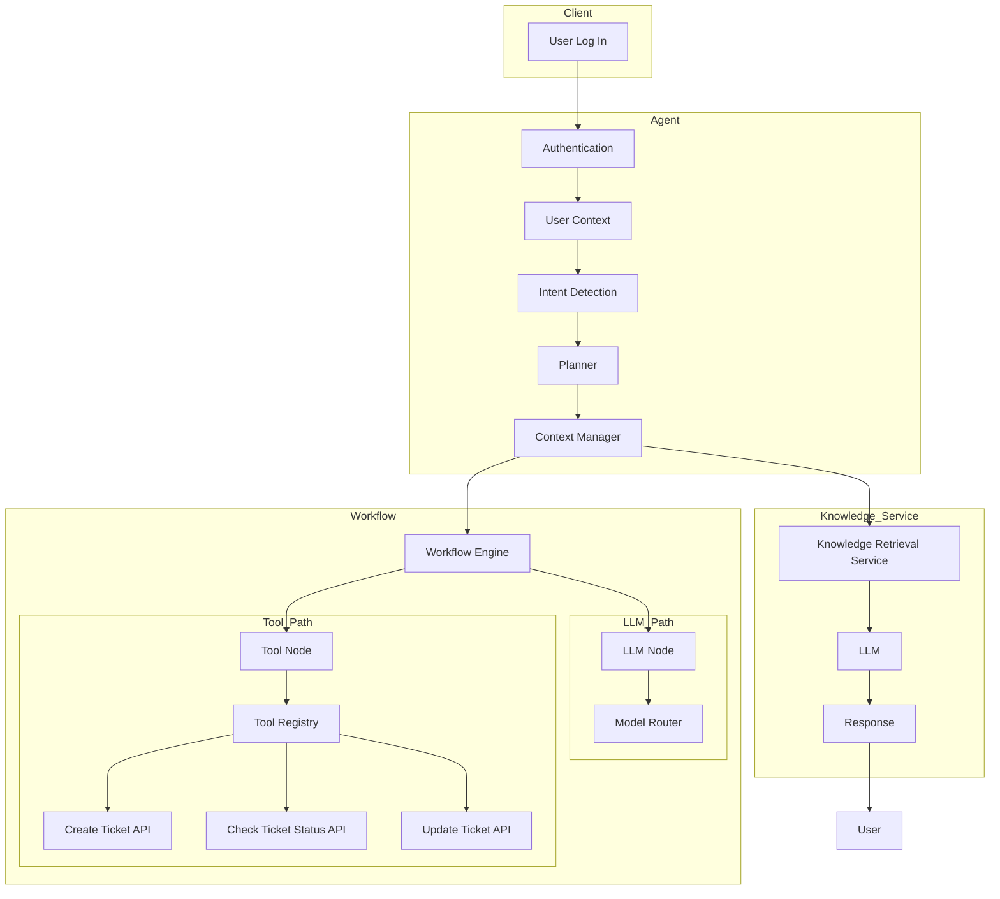

```mermaid
flowchart TD

subgraph Client
    A[User Log In]
end

subgraph Agent
    B[Authentication]
    C[User Context]
    D[Intent Detection]
    E[Planner]
    F[Context Manager]
end

subgraph Knowledge_Service
    G[Knowledge Retrieval Service]
    H[LLM]
    I[Response]
end

subgraph Workflow
    K[Workflow Engine]

    subgraph LLM_Path
        L[LLM Node]
        M[Model Router]
    end

    subgraph Tool_Path
        N[Tool Node]
        O[Tool Registry]

        P[Create Ticket API]
        Q[Check Ticket Status API]
        R[Update Ticket API]
    end
end

A --> B
B --> C
C --> D
D --> E
E --> F

F --> G
G --> H
H --> I
I --> S[User]

F --> K

K --> L
L --> M

K --> N
N --> O

O --> P
O --> Q
O --> R
```